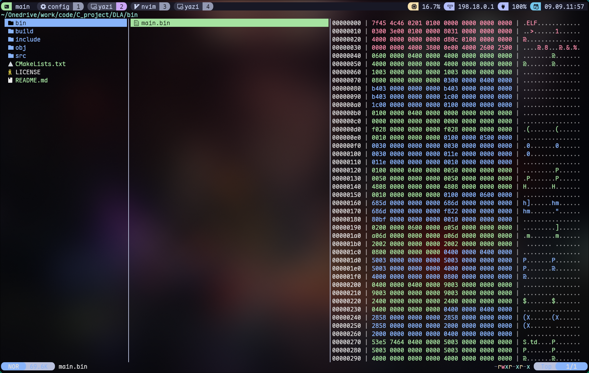

# Hevi Preview Plugin for Yazi



This plugin enables previewing of `*.exe` and `*.bin` files in [yazi](https://github.com/sxyazi/yazi) using [hevi](https://github.com/Arnau478/hevi).

## Requirements

- **Yazi** ≥ 0.2
- **hevi** command must be installed and available in your `$PATH`.

## Installation

Clone this repository into your Yazi plugin directory:

```bash
ya pkg add lihuax-me/hevi
# OR
git clone https://github.com/lihuax-me/hevi.yazi.git ~/.config/yazi/plugins/hevi.yazi
```

## Configuration

Add the following to your `~/.config/yazi/yazi.toml`:

```toml
[plugin]
prepend_previewers = [
    { name = "*.{bin,exe}", run = "hevi" },
]
```

This will preview only `.bin` and `.exe` files with **hevi**.

If you prefer to use **hevi** as a global fallback for any file type, you can instead write:

```toml
[plugin]
prepend_previewers = [
    { name = "*", run = "hevi" },
]
```

Note that using `"*"` may override other preview plugins, since it matches all files.

## Usage

Open Yazi and navigate to any `*.exe` or `*.bin` file.
The plugin will call `hevi` to render a preview in the preview pane.

## Notes

- Ensure the `hevi` binary is installed and accessible from your shell.
- Without `hevi`, this plugin will not work.

## Comparison with hexyl.yazi

Both **hevi.yazi** and [hexyl.yazi](https://github.com/Reledia/hexyl.yazi) provide hex previews, but with different goals:

- **hevi.yazi** — focuses on executables and raw binaries, adds structured parsing for formats like PE/EXE (and ELF).
- **hexyl.yazi** — generic fallback hex viewer, works on any file type but shows only raw bytes.

Use **hevi.yazi** when you want meaningful structure for binaries; use **hexyl.yazi** for universal hex dumps.

## Contributing

Pull requests are welcome. If you find it useful, consider giving the project a ⭐.
